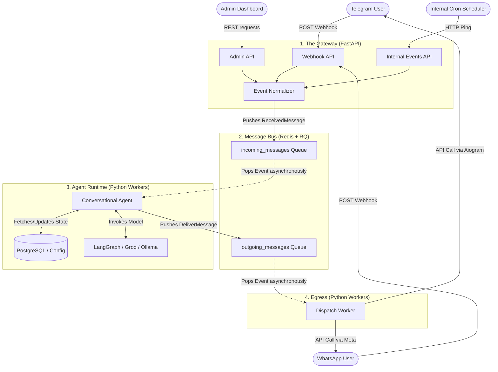

# Healthy5.AI Target Architecture Plan (Event-Driven)

This aligns the Healthy5.AI backend with an **Event-Driven Architecture (EDA)**, drawing high-level inspiration from agent frameworks like OpenClaw.

## Core Architectural Philosophy

We separate the system into distinct, autonomous zones connected by a Message Bus (Redis):
1.  **The Gateway (Ingress)**: The *single* front door for the entire system. It receives ALL external and internal events (Telegram webhooks, WhatsApp webhooks, Admin API requests, even internal CRON triggers) -> Normalizes them into standard internal events -> Pushes them to the Queue.
2.  **Message Bus (Redis + RQ)**: The durable middle-man queueing system.
3.  **Agent Runtime (Workers)**: Pulls events, executes core logic (DB, LangGraph), and decides on actions.
4.  **Egress (Delivery)**: Pushes finalized responses back to external platforms (Telegram, WhatsApp).

## Architecture Flow Diagram



---

## 🏗 Proposed Folder Structure (Refactoring Target)

We will move away from a monolithic `app/` folder into a domain-driven structure:

```text
backend/
├── src/
│   ├── gateway/               # 1. THE GATEWAY (Single Interface / FastAPI)
│   │   ├── main.py            # FastAPI App initialization
│   │   ├── api/               # Standard REST APIs (e.g., Admin UI)
│   │   ├── webhooks/          # Third-party triggers (Telegram, WhatsApp)
│   │   └── scheduler/         # CRON triggers hitting the gateway internally
│   │
│   ├── workers/               # 3. AGENT RUNTIME & 4. EGRESS (RQ Workers)
│   │   ├── agent_worker.py    # Listens for `incoming_messages`, runs LangGraph
│   │   ├── egress_worker.py   # Listens for `outgoing_messages`, sends via Aiogram
│   │   └── scheduler.py       # Manages CRON tasks and time-based events
│   │
│   ├── core/                  # BUSINESS LOGIC & STATE (Shared by API & Workers)
│   │   ├── agents/            # LangGraph logic (moved from `app/agents/`)
│   │   ├── models.py          # Database schemas / SQLModel
│   │   ├── database.py        # DB Connection setup
│   │   └── config.py          # Settings and Model logic (Ollama vs Groq)
│   │
│   └── events/                # 2. MESSAGE BUS SCHEMAS
│       ├── schemas.py         # Pydantic models defining `ReceivedMessage`, `DeliverMessage`
│       └── broker.py          # Redis/RQ connection utilities
│
├── tests/
├── scripts/                   # e.g., set_webhook.py
└── requirements.txt/.env
```

---

## 📝 Step-by-Step Refactoring Plan

Here is the exact order of operations to transition the current codebase without rewriting everything from scratch at once:

**Phase 1: Infrastructure & Scaffolding**
1.  **Install Dependencies:** Add `redis` and `rq` to requirements.
2.  **Scaffold new structure:** Create the `src/` directory and subfolders (`api`, `workers`, `core`, `events`).
3.  **Create Event Schemas:** Define the standard Pydantic models for the queues (`ReceivedMessage` and `DeliverMessage`) inside `src/events/schemas.py`.

**Phase 2: The Gateway (Single Interface)**
4.  **Create Gateway App:** Move `app/main.py` -> `src/gateway/main.py`. This is our single FastAPI interface.
5.  **Refactor Webhooks:** Update the Telegram webhook so it no longer instantiates the Bot or Update directly. It simply extracts the JSON, validates it, and pushes a standard `ReceivedMessage` to the RQ queue.
6.  **Setup Internal Triggers:** Refactor `app/scheduler.py` so that when a cron job fires, it hits an internal Gateway endpoint (or directly drops a job onto the Queue, depending on preference, but keeping it in the Gateway layer standardizes the entry point).

**Phase 3: Core Logic Migration**
6.  **Migrate domain:** Move `app/agents/`, `app/models.py`, and any database code into `src/core/`. Ensure imports are updated completely.

**Phase 4: The Workers (Agent Runtime & Egress)**
7.  **Create Agent Worker:** Build `src/workers/agent_worker.py` to pop the `ReceivedMessage` from RQ, reconstruct the context, call the LangGraph code in `src/core/agents`, and push a `DeliverMessage` back to the queue.
8.  **Create Egress Worker:** Build `src/workers/egress_worker.py` to pop `DeliverMessage` and use `Bot(token=...)` to send the message.
9.  **Refactor Scheduler:** Move `app/scheduler.py` logic to emit events rather than executing them directly.

**Phase 5: Admin UI API Stub (Future)**
10. Create empty routes in `src/api/admin/` to prepare for the Admin frontend.
